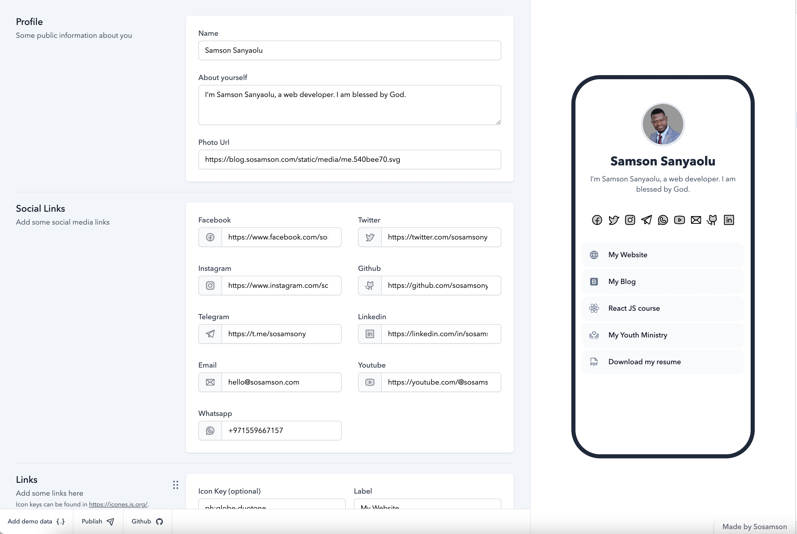

### Don't forget to star this repository✨✨.

# Onelink

Onelink is an experimental link-in-bio tool, where the data lives in the URL. 




## [Click here to create your link](https://onelink.sosamson.com)

> **Note**
> Since the URL can become very long, it's better to use a link shortener like bit.ly

Here's a demo page
https://onelink.sosamson.com/1?data=eyJuIjoiU2Ftc29uIFNhbnlhb2x1IiwiZCI6IknigJltIFNhbXNvbiBTYW55YW9sdSwgYSB3ZWIgZGV2ZWxvcGVyLiBJIGFtIGJsZXNzZWQgYnkgR29kLiIsImkiOiJodHRwczovL2Jsb2cuc29zYW1zb24uY29tL3N0YXRpYy9tZWRpYS9tZS41NDBiZWU3MC5zdmciLCJmIjoiaHR0cHM6Ly93d3cuZmFjZWJvb2suY29tL3Nvc2Ftc29ueSIsInQiOiJodHRwczovL3R3aXR0ZXIuY29tL3Nvc2Ftc29ueSIsImlnIjoiaHR0cHM6Ly93d3cuaW5zdGFncmFtLmNvbS9zb3NhbXNvbnkiLCJlIjoiaGVsbG9Ac29zYW1zb24uY29tIiwiZ2giOiJodHRwczovL2dpdGh1Yi5jb20vc29zYW1zb255IiwidGciOiJodHRwczovL3QubWUvc29zYW1zb255IiwidyI6Iis5NzE1NTk2NjcxNTciLCJ5IjoiaHR0cHM6Ly95b3V0dWJlLmNvbS9Ac29zYW1zb255IiwibCI6Imh0dHBzOi8vbGlua2VkaW4uY29tL2luL3Nvc2Ftc29ueSIsImxzIjpbeyJsIjoiTXkgV2Vic2l0ZSIsImkiOiJwaDpnbG9iZS1kdW90b25lIiwidSI6Imh0dHBzOi8vc29zYW1zb24uY29tIn0seyJsIjoiTXkgQmxvZyIsImkiOiJieGw6Ym9vdHN0cmFwIiwidSI6Imh0dHBzOi8vYmxvZy5zb3NhbXNvbi5jb20ifSx7ImwiOiJSZWFjdCBKUyBjb3Vyc2UiLCJpIjoiZ3JvbW1ldC1pY29uczpyZWFjdGpzIiwidSI6Imh0dHBzOi8vcmVhY3Rqcy5vcmcvIn0seyJsIjoiTXkgWW91dGggTWluaXN0cnkiLCJpIjoiaWNvbm9pcjpkb25hdGUiLCJ1IjoiaHR0cHM6Ly9maW5lc3R3aW5lLm9yZyJ9LHsibCI6IkRvd25sb2FkIG15IHJlc3VtZSIsImkiOiJwaDpmaWxlLXBkZiIsInUiOiJodHRwczovL3Nvc2Ftc29uLmNvbS9yZXN1bWUifV19

The data is converted to a base 64 string which we onelink uses as a query parameter. I have tried to reduce the json keys to be as small as possible

Roadmap.
1. Templates - make different templates, the `/1` after the host is basically a template here.
2. Refactor code - a lot of repeated boilerplate code is added here - refactor it properly.

## Setup locally

Make sure to install the dependencies:

```bash
# yarn
yarn install

# npm
npm install

# pnpm
pnpm install --shamefully-hoist
```

## Development Server

Start the development server on http://localhost:3000

```bash
npm run dev
```

## Production

Build the application for production:

```bash
npm run build
```

Locally preview production build:

```bash
npm run preview
```

Checkout the [deployment documentation](https://v3.nuxtjs.org/guide/deploy/presets) for more information.


## Don't forget to star this repository✨✨.


<a href="https://sosamson.com" target = "_blank" 
rel = "noopener noreferrer">Samson Sanyaolu</a> •


## [Follow on LinkedIn](https://linkedin.com/in/sosamsony)
